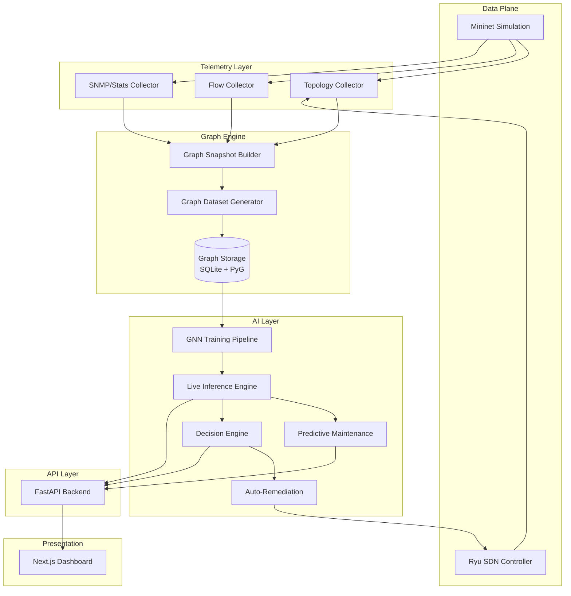

# GNN Migration Technical Report — Part 1/2

> **Project:** Intelligent Network Traffic Prediction & Anomaly Detection  
> **Goal:** Transform into a Graph Neural Network-powered Intelligent Network Operations Platform  
> **Date:** April 28, 2026

---

# 1. Current State Assessment

## 1.1 Codebase Inventory

| Component | Path | Tech | Status |
|-----------|------|------|--------|
| Mininet SDN Sim | `mininetDashboard/` | Flask + Mininet + D3.js | ✅ Mature |
| ML Training | `ml_training/` | Jupyter + XGBoost + sklearn | ✅ Working |
| Backend API | `models_api/` | FastAPI + joblib | ✅ Working |
| Frontend | `network-monitoring-dashboard/` | Next.js 16 + Recharts + Tailwind v4 | ✅ Working |
| Infrastructure | `infra/` | Docker (empty compose) | ⚠️ Placeholder |
| Docs | `docs/` | Markdown | ✅ Good |

## 1.2 Strengths — What to Keep

| Asset | Why Keep | GNN Role |
|-------|----------|----------|
| [topology.py](file:///Users/alaeddine/dev/Intelligent-Network-Traffic-Prediction-and-Anomaly-Detection/mininetDashboard/backend/topology.py) — `RealWorldTopo` | Multi-domain topology (6 switches, 6 routers, 18 hosts, 5 zones) already modeled | **Direct graph source** — becomes the adjacency matrix |
| [topology.py](file:///Users/alaeddine/dev/Intelligent-Network-Traffic-Prediction-and-Anomaly-Detection/mininetDashboard/backend/topology.py) — `get_node_type()`, `get_node_zone()` | Node classification by role and zone | **Node feature encoders** |
| [services.py](file:///Users/alaeddine/dev/Intelligent-Network-Traffic-Prediction-and-Anomaly-Detection/mininetDashboard/backend/services.py) — `topology_payload()` | Already serializes nodes/links as JSON graph | **Graph snapshot serializer** |
| [lab.py](file:///Users/alaeddine/dev/Intelligent-Network-Traffic-Prediction-and-Anomaly-Detection/mininetDashboard/backend/lab.py) — `LabPipeline` | Capture → tshark → flow features pipeline | **Telemetry collection backbone** |
| [lab.py](file:///Users/alaeddine/dev/Intelligent-Network-Traffic-Prediction-and-Anomaly-Detection/mininetDashboard/backend/lab.py) — `_build_flow_features()` | CICIDS-style bidirectional flow aggregation | **Edge feature extractor** |
| [anomalies_routes.py](file:///Users/alaeddine/dev/Intelligent-Network-Traffic-Prediction-and-Anomaly-Detection/models_api/app/api/anomalies_routes.py) — IDS pipeline | 15-class attack classifier (XGBoost) | **Baseline comparison model** |
| [predictions_routes.py](file:///Users/alaeddine/dev/Intelligent-Network-Traffic-Prediction-and-Anomaly-Detection/models_api/app/api/predictions_routes.py) — Forecasting | XGBoost autoregressive 24h forecaster | **Keep as fallback predictor** |
| Next.js Dashboard | Full monitoring UI with charts, tables, alerts | **Extend with topology viz** |
| CICIDS2017 Dataset | 884MB labeled data across 8 CSV files | **Supplementary training data** |

## 1.3 Weaknesses — What Must Change

| Problem | Location | Impact |
|---------|----------|--------|
| **No graph structure in ML** | `ml_training/`, `models_api/` | Models treat flows as flat rows — zero topology awareness |
| **Hardcoded mock data** | `dashboard_bridge.py`, `metrics_routes.py` | Predictions/metrics use fabricated numbers, not real inference |
| **Intelligence plane is rule-based** | `intelligence.py` — 3 threshold rules | No learned model, just `pkt_rate > 220` |
| **No persistent storage** | Entire project | No database — all state is in-memory or file-based |
| **Empty model_loader.py** | `models_api/app/model_loader.py` | Model loading scattered across route files |
| **No real-time pipeline** | `lab.py` is batch-only | Capture → stop → export → infer (no streaming) |
| **Empty Docker setup** | `infra/docker-compose.yml` | Zero deployment infrastructure |
| **No graph visualization** | Frontend | Dashboard has charts but no topology map |
| **Anomaly API uses mock flows** | `anomalies_routes.py:95-214` | `generate_mock_network_flows()` creates random data, not real traffic |

## 1.4 Technical Debt Blocking GNN Migration

1. **Flow features ≠ Graph features**: `_build_flow_features()` outputs flat CSV rows per flow. GNN needs node feature vectors, edge feature vectors, and an adjacency structure.
2. **No graph data format**: No PyG `Data` objects, no NetworkX export, no adjacency lists.
3. **Topology and ML are decoupled**: Mininet topology lives in `mininetDashboard/`, ML lives in `models_api/` — they share nothing.
4. **No telemetry time-series**: Current system captures one session at a time. GNN temporal models need sequential graph snapshots.

---

# 2. New Target Architecture

## 2.1 System Overview



## 2.2 Component Design

### A. Mininet + SDN Layer (Keep & Extend)

**Keep:** `RealWorldTopo`, `configure_network()`, `NetworkManager`  
**Add:** Scenario runner that creates varied topologies (link failures, load changes)

```
mininetDashboard/backend/
├── topology.py          # KEEP — add topology variation methods
├── network_manager.py   # KEEP — add topology change hooks
├── scenarios/           # NEW
│   ├── normal.py        # Baseline traffic
│   ├── ddos.py          # DDoS attack scenarios
│   ├── link_failure.py  # Link down/degradation
│   ├── congestion.py    # Overload scenarios
│   └── scan.py          # Port scan / recon
```

### B. Telemetry Collectors (Extend `lab.py`)

```
mininetDashboard/backend/
├── collectors/               # NEW
│   ├── topology_collector.py # Polls net.links, net.hosts — builds adjacency
│   ├── flow_collector.py     # Continuous tshark/tcpdump — streams flow stats
│   └── stats_collector.py    # Per-switch port counters via Ryu REST
```

### C. Graph Snapshot Builder (NEW)

Merges topology + telemetry into a single graph snapshot per time window.

```
gnn_engine/
├── graph_builder.py     # Builds PyG Data objects from collectors
├── feature_engineer.py  # Computes node/edge/global features
├── snapshot_store.py    # Stores time-indexed graph snapshots
```

### D. GNN Training Pipeline (NEW)

```
gnn_engine/
├── models/
│   ├── gat_classifier.py    # GAT for node/edge classification
│   ├── graphsage_pred.py    # GraphSAGE for traffic prediction
│   ├── temporal_gnn.py      # T-GCN for time-series on graphs
│   └── hybrid_model.py      # Combined detection + prediction
├── training/
│   ├── train.py             # Training loop with early stopping
│   ├── evaluate.py          # Metrics, confusion matrix, ROC
│   └── explain.py           # GNNExplainer integration
├── dataset/
│   ├── graph_dataset.py     # PyG InMemoryDataset subclass
│   └── transforms.py        # Feature normalization, augmentation
```

### E. Live Inference Engine (NEW)

```
gnn_engine/
├── inference/
│   ├── live_engine.py       # Loads model, scores graph snapshots
│   ├── anomaly_scorer.py    # Produces per-node/edge anomaly scores
│   └── predictor.py         # Forecasts next-N graph states
```

### F. Predictive Maintenance + Decision + Remediation Engines (NEW)

```
gnn_engine/
├── maintenance/
│   ├── risk_predictor.py    # Congestion/failure risk scoring
│   └── capacity_planner.py  # Bandwidth exhaustion forecasting
├── decisions/
│   ├── rule_engine.py       # Deterministic policy rules
│   ├── decision_agent.py    # Hybrid rule+ML action selector
│   └── actions.py           # Reroute, isolate, throttle, alert
├── remediation/
│   ├── sdn_actuator.py      # Pushes flow rules via Ryu REST
│   └── rollback.py          # Undo actions if health degrades
```

### G. Backend API (Extend `models_api/`)

```
models_api/app/api/
├── metrics_routes.py        # KEEP — wire to real inference
├── alerts_routes.py         # KEEP — wire to decision engine
├── anomalies_routes.py      # MODIFY — use GNN inference
├── predictions_routes.py    # MODIFY — use GNN predictor
├── topology_routes.py       # NEW — live graph state
├── gnn_routes.py            # NEW — model status, retraining triggers
├── maintenance_routes.py    # NEW — risk scores, predictions
├── decisions_routes.py      # NEW — action log, manual overrides
```

### H. Frontend Dashboard (Extend)

```
network-monitoring-dashboard/app/
├── page.tsx                 # KEEP — add topology widget
├── topology/                # NEW — interactive network graph (D3/react-force-graph)
│   └── page.tsx
├── gnn-insights/            # NEW — GNN predictions, explanations
│   └── page.tsx
├── maintenance/             # NEW — risk scores, capacity warnings
│   └── page.tsx
├── decisions/               # NEW — action log, remediation status
│   └── page.tsx
```

### I. Storage Layer

| Data | Storage | Format |
|------|---------|--------|
| Graph snapshots | `data/graphs/` | PyG `.pt` files |
| Training datasets | `data/datasets/` | PyG `InMemoryDataset` |
| Trained models | `models/gnn/` | PyTorch `.pth` checkpoints |
| Inference results | SQLite `data/results.db` | JSON-serialized scores |
| Time-series metrics | SQLite `data/metrics.db` | Tabular |

### J. Deployment Strategy

```yaml
# infra/docker-compose.yml
services:
  mininet-sim:      # Mininet + Ryu + telemetry collectors
  gnn-engine:       # Training + inference service (GPU optional)
  api:              # FastAPI backend
  dashboard:        # Next.js frontend
  db:               # SQLite (or PostgreSQL for production)
```

---

# 3. Data Generation Strategy

## 3.1 Topology Configurations

Generate diverse topologies by parameterizing `RealWorldTopo`:

| Topology Variant | Nodes | Purpose |
|-----------------|-------|---------|
| **Small Enterprise** | 10-15 | Fast iteration |
| **Current RealWorldTopo** | 30+ | Baseline (already built) |
| **Large Campus** | 50-80 | Scale testing |
| **Multi-DC** | 40-60 | Cross-datacenter scenarios |

```python
# gnn_engine/data_gen/topology_variants.py
class ScalableTopo(Topo):
    def build(self, n_enterprises=2, n_homes=2, n_dc_hosts=4):
        # Parameterized version of RealWorldTopo
        ...
```

## 3.2 Traffic Generation Scenarios

| Scenario | Tool | Duration | Label |
|----------|------|----------|-------|
| Normal browsing | `curl`, `wget` | 60-120s | `BENIGN` |
| Normal DNS | `dig`, `nslookup` | 30s | `BENIGN` |
| Bulk transfer | `iperf3` | 30-60s | `BENIGN` |
| DDoS flood | `hping3 --flood` | 20-40s | `DDOS` |
| SYN flood | `hping3 -S` | 20s | `SYN_FLOOD` |
| Port scan | `nmap -sS` | 15-30s | `PORT_SCAN` |
| Ping sweep | `nmap -sP` | 10s | `SCAN` |
| Slowloris | `slowloris` | 30s | `SLOWLORIS` |
| Link down | `ip link set down` | N/A | `LINK_FAILURE` |
| Congestion | `iperf3` high-bw | 30s | `CONGESTION` |
| Route flap | Toggle routes | 20s | `ROUTE_INSTABILITY` |
| Broadcast storm | `ping -b` | 15s | `BROADCAST_STORM` |

## 3.3 Graph Snapshot Structure

Each snapshot at time `t` produces a PyG `Data` object:

```python
import torch
from torch_geometric.data import Data

snapshot = Data(
    # Node features: [num_nodes, node_feat_dim]
    x=torch.tensor([...], dtype=torch.float),
    
    # Edge index: [2, num_edges] — COO format
    edge_index=torch.tensor([[src1,src2,...], [dst1,dst2,...]], dtype=torch.long),
    
    # Edge features: [num_edges, edge_feat_dim]
    edge_attr=torch.tensor([...], dtype=torch.float),
    
    # Node labels: [num_nodes] — per-node anomaly class
    y=torch.tensor([...], dtype=torch.long),
    
    # Edge labels: [num_edges] — per-edge anomaly class
    edge_y=torch.tensor([...], dtype=torch.long),
    
    # Global label: graph-level anomaly class
    graph_y=torch.tensor([0], dtype=torch.long),
    
    # Timestamp
    timestamp=torch.tensor([t], dtype=torch.float),
)
```

## 3.4 Feature Engineering

### Node Features (dim=14)

| # | Feature | Source |
|---|---------|--------|
| 1 | `node_type` (one-hot, 7 types) | `get_node_type()` |
| 2 | `zone` (one-hot, 6 zones) | `get_node_zone()` → encoded |
| 3 | `degree` | Adjacency count |
| 4 | `total_bytes_in` | Flow collector aggregation |
| 5 | `total_bytes_out` | Flow collector aggregation |
| 6 | `total_packets_in` | Flow collector |
| 7 | `total_packets_out` | Flow collector |
| 8 | `active_flows` | Count of flows involving node |
| 9 | `avg_flow_duration` | Mean flow duration |
| 10 | `cpu_utilization` | Simulated or from `ovs-vsctl` |
| 11 | `packet_drop_rate` | Switch port stats |
| 12 | `avg_latency_ms` | Ping probes |
| 13 | `bytes_per_second` | Rate metric |
| 14 | `is_attacker` | Ground truth (training only) |

### Edge Features (dim=12)

| # | Feature | Source |
|---|---------|--------|
| 1 | `link_type` (data/control) | `topology_payload()` |
| 2 | `total_bytes` | Sum of flow bytes on link |
| 3 | `total_packets` | Sum of flow packets on link |
| 4 | `flow_count` | Number of active flows |
| 5 | `avg_packet_size` | Mean packet length |
| 6 | `bandwidth_utilization` | bytes/capacity |
| 7 | `avg_iat` | Mean inter-arrival time |
| 8 | `iat_std` | IAT standard deviation |
| 9 | `packet_loss_rate` | Dropped/total |
| 10 | `latency_ms` | Link-level RTT |
| 11 | `is_active` | Link up/down boolean |
| 12 | `anomaly_flow_ratio` | Suspicious flows / total |

### Global Features (dim=6)

| Feature | Description |
|---------|-------------|
| `total_traffic_bytes` | Network-wide traffic volume |
| `total_active_flows` | Global flow count |
| `avg_link_utilization` | Mean bandwidth usage |
| `max_link_utilization` | Hottest link |
| `anomaly_ratio` | Flagged nodes / total |
| `time_of_day` | Cyclical encoding (sin/cos) |

## 3.5 Dataset Storage

```
data/
├── graphs/
│   ├── scenario_normal_001/
│   │   ├── snapshot_t0.pt
│   │   ├── snapshot_t1.pt
│   │   └── ...
│   ├── scenario_ddos_001/
│   └── ...
├── datasets/
│   ├── train_dataset.pt      # PyG InMemoryDataset
│   ├── val_dataset.pt
│   └── test_dataset.pt
└── metadata.json             # Scenario descriptions, label mappings
```

Collection target: **500-1000 graph snapshots** across all scenarios (5-second intervals × multiple scenarios).

---

# 4. Anomalies to Detect

## 4.1 Security Anomalies

| Anomaly | Node Label | Edge Label | Detection Method |
|---------|-----------|-----------|-----------------|
| **DDoS Flood** | Target node: high `bytes_in` | Affected edges: spike in `total_packets` | Node + edge classification |
| **SYN Flood** | Target: high half-open connections | Edge: abnormal `flow_count` with low `avg_packet_size` | Edge classification |
| **Port Scan** | Scanner: high `active_flows`, many destinations | Many edges with 1-2 packets each | Node classification |
| **Brute Force** | Target: high connection attempts | Edge: many short flows to auth ports | Edge classification |
| **Botnet C&C** | Bot nodes: periodic small flows to C&C | Regular beacon pattern in IAT | Temporal pattern |
| **Data Exfiltration** | Source: abnormal `bytes_out` ratio | Edge: large outbound transfer | Node anomaly score |
| **ARP Spoofing** | Node with duplicate IP mappings | N/A | Node feature anomaly |

## 4.2 Operational Anomalies

| Anomaly | Node Label | Edge Label | Detection Method |
|---------|-----------|-----------|-----------------|
| **Congestion** | Switch: high `packet_drop_rate` | Edge: `bandwidth_utilization > 0.85` | Node + edge regression |
| **Link Failure** | Adjacent nodes lose connectivity | Edge: `is_active=0` | Edge classification |
| **Latency Spike** | Node: high `avg_latency_ms` | Edge: `latency_ms` above baseline | Temporal prediction |
| **Route Instability** | Router: frequent route changes | Path length variations | Graph-level classification |
| **Broadcast Storm** | All nodes in segment: traffic spike | All edges in segment: saturated | Subgraph classification |
| **Switch Overload** | Switch: high CPU, high drops | All switch edges degraded | Node classification |
| **Capacity Exhaustion** | Node: utilization trending to 100% | Edge: utilization curve | Temporal prediction |

## 4.3 Label Taxonomy

```python
NODE_LABELS = {
    0: "NORMAL",
    1: "DDOS_TARGET",
    2: "SCANNER",
    3: "BRUTE_FORCE_TARGET",
    4: "BOT",
    5: "CONGESTED_SWITCH",
    6: "OVERLOADED",
    7: "FAILING",
}

EDGE_LABELS = {
    0: "NORMAL",
    1: "DDOS_FLOW",
    2: "SCAN_FLOW",
    3: "HIGH_LATENCY",
    4: "CONGESTED",
    5: "LINK_DOWN",
    6: "EXFILTRATION",
}

GRAPH_LABELS = {
    0: "HEALTHY",
    1: "UNDER_ATTACK",
    2: "DEGRADED",
    3: "CRITICAL",
}
```

---

# 5. GNN Model Design

## 5.1 Model Selection Rationale

| Model | Use Case | Why |
|-------|----------|-----|
| **GAT** (Graph Attention) | Primary anomaly detector | Attention weights provide explainability — shows which neighbor influences the anomaly score most |
| **GraphSAGE** | Scalable node embedding | Inductive learning works on unseen nodes — critical when topology changes |
| **T-GCN** (Temporal GCN) | Traffic prediction | Combines GCN spatial features with GRU temporal dynamics |
| **Hybrid GAT+GRU** | Production model | Best of both: spatial attention + temporal memory |

## 5.2 Architecture Details

### Model A: GAT Anomaly Detector (Node + Edge Classification)

```python
import torch.nn as nn
from torch_geometric.nn import GATv2Conv, global_mean_pool

class GATAnomalyDetector(nn.Module):
    def __init__(self, node_feat_dim=14, edge_feat_dim=12,
                 hidden_dim=64, n_heads=4, n_node_classes=8, n_edge_classes=7):
        super().__init__()
        self.conv1 = GATv2Conv(node_feat_dim, hidden_dim, heads=n_heads,
                               edge_dim=edge_feat_dim, concat=True)
        self.conv2 = GATv2Conv(hidden_dim * n_heads, hidden_dim, heads=1,
                               edge_dim=edge_feat_dim, concat=False)
        
        # Node classifier
        self.node_head = nn.Sequential(
            nn.Linear(hidden_dim, 32), nn.ReLU(), nn.Dropout(0.3),
            nn.Linear(32, n_node_classes)
        )
        # Edge classifier  
        self.edge_head = nn.Sequential(
            nn.Linear(hidden_dim * 2 + edge_feat_dim, 32), nn.ReLU(),
            nn.Linear(32, n_edge_classes)
        )

    def forward(self, data):
        x, edge_index, edge_attr = data.x, data.edge_index, data.edge_attr
        
        x = self.conv1(x, edge_index, edge_attr=edge_attr).relu()
        x = self.conv2(x, edge_index, edge_attr=edge_attr).relu()
        
        node_logits = self.node_head(x)
        
        src, dst = edge_index
        edge_repr = torch.cat([x[src], x[dst], edge_attr], dim=-1)
        edge_logits = self.edge_head(edge_repr)
        
        return node_logits, edge_logits
```

**Input/Output:**
- Input: `Data(x=[N,14], edge_index=[2,E], edge_attr=[E,12])`
- Output: `node_logits=[N,8]`, `edge_logits=[E,7]`

### Model B: Temporal GNN (Traffic Prediction)

```python
class TemporalGNN(nn.Module):
    def __init__(self, node_feat_dim=14, hidden_dim=64, pred_horizon=6):
        super().__init__()
        self.gcn1 = GCNConv(node_feat_dim, hidden_dim)
        self.gcn2 = GCNConv(hidden_dim, hidden_dim)
        self.gru = nn.GRU(hidden_dim, hidden_dim, batch_first=True)
        self.predictor = nn.Linear(hidden_dim, pred_horizon)  # Predict next 6 intervals
    
    def forward(self, graph_sequence):
        # graph_sequence: list of T Data objects
        embeddings = []
        for g in graph_sequence:
            h = self.gcn1(g.x, g.edge_index).relu()
            h = self.gcn2(h, g.edge_index)
            embeddings.append(h)
        
        # Stack: [N, T, hidden_dim]
        seq = torch.stack(embeddings, dim=1)
        _, h_n = self.gru(seq)  # [1, N, hidden_dim]
        pred = self.predictor(h_n.squeeze(0))  # [N, pred_horizon]
        return pred
```

**Input/Output:**
- Input: Sequence of `T` graph snapshots (e.g., T=12 → last 60 seconds at 5s intervals)
- Output: `[N, pred_horizon]` — predicted node-level traffic for next 6 intervals

### Model C: Hybrid Production Model

```python
class HybridGNNModel(nn.Module):
    """Combined anomaly detection + prediction."""
    def __init__(self, node_dim=14, edge_dim=12, hidden=64):
        super().__init__()
        # Shared spatial encoder
        self.spatial = GATv2Conv(node_dim, hidden, heads=4, edge_dim=edge_dim)
        self.temporal = nn.GRU(hidden * 4, hidden, batch_first=True)
        
        # Task-specific heads
        self.anomaly_head = nn.Linear(hidden, 8)   # Node anomaly classes
        self.traffic_head = nn.Linear(hidden, 6)   # 6-step forecast
        self.risk_head = nn.Linear(hidden, 1)       # Risk score [0,1]
```

## 5.3 Training Configuration

| Parameter | Value |
|-----------|-------|
| Optimizer | AdamW, lr=1e-3 |
| Scheduler | CosineAnnealing, T_max=50 |
| Loss (classification) | CrossEntropy with class weights |
| Loss (regression) | MSE + Huber for outlier robustness |
| Epochs | 100 with early stopping (patience=10) |
| Batch size | 32 graphs per batch |
| Train/Val/Test | 70/15/15 split by scenario |

## 5.4 Explainability

```python
from torch_geometric.explain import Explainer, GNNExplainer

explainer = Explainer(
    model=model,
    algorithm=GNNExplainer(epochs=200),
    explanation_type='model',
    node_mask_type='attributes',
    edge_mask_type='object',
)
# For a flagged anomalous node:
explanation = explainer(data.x, data.edge_index, index=anomalous_node_id)
# Returns: node feature importance + edge importance masks
# → "Node e1_pc1 flagged because edges to dc_web show 10x normal packet rate"
```

**Dashboard integration:** Explainability results feed into the frontend as highlighted subgraphs showing *why* an anomaly was detected.

---

*Continued in Part 2: Predictive Maintenance, Decision Engine, Migration Plan, Team Plan, and MVP.*
