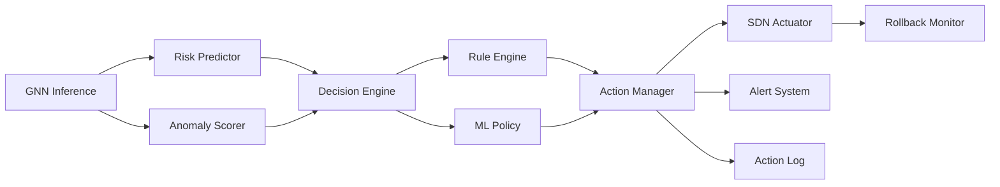

# GNN Migration Technical Report — Part 2/2

> Sections 6–10: Predictive Maintenance, Decision Engine, Migration Plan, Team Plan, MVP

---

# 6. Predictive / Preventive Maintenance

## 6.1 Module Design

```
gnn_engine/maintenance/
├── risk_predictor.py      # Scores each node/edge for failure risk
├── capacity_planner.py    # Projects bandwidth exhaustion timelines
└── trend_analyzer.py      # Detects degradation trends over time
```

## 6.2 Prediction Targets

| Prediction | Model Input | Output | Horizon |
|-----------|-------------|--------|---------|
| **Congestion Risk** | Node traffic history (T-GCN embeddings) | Risk score 0-1 per node | 5-30 min |
| **Link Failure Probability** | Edge utilization + error rates over time | Probability 0-1 per edge | 10-60 min |
| **Switch Overload** | Switch CPU + flow table size + packet drops | Overload probability per switch | 5-15 min |
| **Capacity Exhaustion** | Edge bandwidth utilization trend | Time-to-saturation (minutes) | 1-6 hours |
| **Route Instability** | Path change frequency + latency variance | Instability score per router | 5-30 min |

## 6.3 Risk Predictor Implementation

```python
class RiskPredictor:
    """Uses Temporal GNN embeddings to score failure risk."""
    
    def __init__(self, temporal_model, threshold=0.7):
        self.model = temporal_model
        self.threshold = threshold
    
    def predict_risks(self, graph_sequence):
        """Score every node in the network for risk.
        
        Returns:
            dict mapping node_id -> {
                'congestion_risk': float,
                'overload_risk': float,
                'failure_risk': float,
                'time_to_critical': int (minutes),
                'recommended_action': str
            }
        """
        with torch.no_grad():
            # Get temporal embeddings for all nodes
            predictions = self.model(graph_sequence)  # [N, pred_horizon]
        
        risks = {}
        for node_idx in range(predictions.shape[0]):
            future_load = predictions[node_idx]
            trend = (future_load[-1] - future_load[0]).item()
            max_load = future_load.max().item()
            
            risks[node_idx] = {
                'congestion_risk': min(1.0, max_load / CAPACITY_THRESHOLD),
                'overload_risk': 1.0 if max_load > OVERLOAD_THRESHOLD else max_load / OVERLOAD_THRESHOLD,
                'failure_risk': self._compute_failure_prob(future_load),
                'time_to_critical': self._estimate_time_to_critical(future_load),
                'trend': 'increasing' if trend > 0.1 else 'decreasing' if trend < -0.1 else 'stable',
            }
        
        return risks
```

## 6.4 Capacity Planner

```python
class CapacityPlanner:
    """Projects when links will exhaust bandwidth."""
    
    def forecast_exhaustion(self, edge_utilization_history):
        """Linear + exponential regression on utilization trend.
        
        Returns time_to_saturation in minutes, or None if stable.
        """
        if len(edge_utilization_history) < 6:
            return None
        
        x = np.arange(len(edge_utilization_history))
        y = np.array(edge_utilization_history)
        
        # Linear fit
        slope, intercept = np.polyfit(x, y, 1)
        
        if slope <= 0:
            return None  # Utilization decreasing
        
        # Time until utilization = 1.0
        steps_to_full = (1.0 - y[-1]) / slope
        interval_seconds = 5  # Graph snapshot interval
        return max(0, int(steps_to_full * interval_seconds / 60))
```

## 6.5 API Output Format

```json
{
  "maintenance_alerts": [
    {
      "node": "ent1_sw",
      "risk_type": "congestion",
      "risk_score": 0.82,
      "time_to_critical_min": 12,
      "trend": "increasing",
      "recommendation": "Reroute 30% of traffic via ent2_sw"
    },
    {
      "edge": ["r_ent1", "isp_core"],
      "risk_type": "capacity_exhaustion",
      "utilization": 0.87,
      "time_to_saturation_min": 25,
      "recommendation": "Enable load balancing across backup path"
    }
  ]
}
```

---

# 7. Intelligent Decision Engine

## 7.1 Architecture



## 7.2 Decision Framework: Hybrid Approach

### Why Hybrid (Rules + ML), Not Pure RL

| Factor | Rule-Based | Pure RL | **Hybrid (Recommended)** |
|--------|-----------|---------|--------------------------|
| Safety | ✅ Predictable | ❌ Unpredictable | ✅ Rules for critical, ML for optimization |
| Speed to deploy | ✅ Fast | ❌ Needs training | ✅ Rules first, ML added later |
| Adaptability | ❌ Rigid | ✅ Learns | ✅ ML handles novel patterns |
| Explainability | ✅ Clear | ❌ Black box | ✅ Rules explain, ML suggests |
| Your timeline (4 weeks) | ✅ Feasible | ❌ Too complex | ✅ Practical |

### Rule Engine (Phase 1 — Deploy Immediately)

```python
class RuleEngine:
    """Deterministic safety rules. Always executes first."""
    
    RULES = [
        # (condition, action, priority)
        ("node.anomaly_class == 'DDOS_TARGET' and confidence > 0.9",
         "rate_limit_inbound(node, max_bps=10_000_000)", "CRITICAL"),
        
        ("edge.label == 'LINK_DOWN'",
         "reroute_via_backup(edge)", "CRITICAL"),
        
        ("node.congestion_risk > 0.85",
         "redistribute_flows(node, ratio=0.3)", "HIGH"),
        
        ("node.anomaly_class == 'SCANNER' and confidence > 0.8",
         "isolate_node(node, duration_min=10)", "HIGH"),
        
        ("edge.utilization > 0.90",
         "enable_load_balancing(edge)", "MEDIUM"),
        
        ("node.risk_score > 0.7",
         "trigger_alert(node, level='WARNING')", "MEDIUM"),
    ]
```

### ML Policy (Phase 4 — After Data Collection)

```python
class MLPolicy:
    """Learned policy for non-critical optimization decisions."""
    
    def __init__(self):
        # Simple DQN for action selection on non-critical scenarios
        self.model = DQN(state_dim=64, n_actions=5)
        # Actions: [do_nothing, reroute, throttle, rebalance, scale_up]
    
    def suggest_action(self, gnn_embedding, risk_scores):
        """Only called when no critical rule fires."""
        state = torch.cat([gnn_embedding, risk_scores])
        action_id = self.model.select_action(state)
        return self.ACTIONS[action_id]
```

## 7.3 Action Catalog

| Action | Method | SDN Implementation |
|--------|--------|-------------------|
| **Reroute traffic** | Push new flow rules via Ryu REST | `POST /stats/flowentry/add` |
| **Isolate node** | Drop rules on switch ports for node | `POST /stats/flowentry/add` with `DROP` |
| **Rate limit** | Meter bands on switch | OVS `set-queue` or OpenFlow meters |
| **Rebalance load** | ECMP or weighted path selection | Multiple flow rules with `group` |
| **Prioritize service** | QoS queue assignment | `ovs-vsctl set-queue` |
| **Trigger alert** | Push to API → dashboard | WebSocket notification |

## 7.4 Rollback Safety

```python
class RollbackMonitor:
    """Monitors health after action execution. Reverts if degraded."""
    
    def execute_with_rollback(self, action, sdn_actuator, health_monitor):
        # Save current state
        snapshot_before = health_monitor.current_health()
        
        # Execute action
        action_id = sdn_actuator.execute(action)
        
        # Wait and check
        time.sleep(10)
        snapshot_after = health_monitor.current_health()
        
        if snapshot_after.score < snapshot_before.score * 0.9:
            sdn_actuator.rollback(action_id)
            return {"status": "rolled_back", "reason": "health_degraded"}
        
        return {"status": "applied", "action_id": action_id}
```

---

# 8. Migration Plan — Phased Roadmap

## Phase 1: Quick Wins (Week 1) — Use Current Code

**Goal:** Wire real inference to dashboard, add topology visualization.

| Task | File(s) | Action |
|------|---------|--------|
| Centralize model loading | `models_api/app/model_loader.py` | Implement singleton loader for both models |
| Wire real IDS results to metrics | `metrics_routes.py` | Replace hardcoded values with IDS model output |
| Wire real XGBoost results to dashboard | `predictions_routes.py` | Feed actual Mininet flow data |
| Add topology API endpoint | `models_api/app/api/topology_routes.py` | **NEW** — serve graph JSON from Mininet |
| Add topology page to frontend | `network-monitoring-dashboard/app/topology/page.tsx` | **NEW** — D3 force graph in React |
| Connect mininetDashboard data to models_api | `models_api/app/api/` | Add SSE/polling bridge |

**New folders:** None major — mostly edits to existing files.  
**Effort:** 5-7 developer-days  
**Risk:** Low — no new ML, only wiring

## Phase 2: Graph Data Pipeline (Week 2)

**Goal:** Build graph snapshot pipeline from Mininet → PyG format.

| Task | File(s) | Action |
|------|---------|--------|
| Create `gnn_engine/` package | `gnn_engine/__init__.py` | **NEW** top-level package |
| Topology collector | `gnn_engine/collectors/topology_collector.py` | **NEW** — polls `net.links`, builds adjacency |
| Flow collector | `gnn_engine/collectors/flow_collector.py` | **NEW** — wraps `lab.py` flow extraction for continuous use |
| Stats collector | `gnn_engine/collectors/stats_collector.py` | **NEW** — Ryu REST port stats |
| Graph snapshot builder | `gnn_engine/graph_builder.py` | **NEW** — merges collectors → PyG `Data` |
| Feature engineer | `gnn_engine/feature_engineer.py` | **NEW** — node/edge/global features |
| Snapshot store | `gnn_engine/snapshot_store.py` | **NEW** — saves `.pt` files |
| Scenario runner | `mininetDashboard/backend/scenarios/` | **NEW** — orchestrated attack/normal scenarios |
| Dataset generator script | `gnn_engine/generate_dataset.py` | **NEW** — runs scenarios + captures snapshots |
| Graph dataset class | `gnn_engine/dataset/graph_dataset.py` | **NEW** — PyG `InMemoryDataset` |

**New folders:**
```
gnn_engine/
├── __init__.py
├── collectors/
├── dataset/
├── graph_builder.py
├── feature_engineer.py
├── snapshot_store.py
└── generate_dataset.py

mininetDashboard/backend/scenarios/
```

**Effort:** 8-10 developer-days  
**Risk:** Medium — depends on Mininet environment stability and tshark performance

## Phase 3: First GNN Deployment (Week 3)

**Goal:** Train GAT model, deploy inference, show results in dashboard.

| Task | File(s) | Action |
|------|---------|--------|
| GAT model implementation | `gnn_engine/models/gat_classifier.py` | **NEW** |
| GraphSAGE model | `gnn_engine/models/graphsage_pred.py` | **NEW** |
| Temporal GNN | `gnn_engine/models/temporal_gnn.py` | **NEW** |
| Training pipeline | `gnn_engine/training/train.py` | **NEW** |
| Evaluation pipeline | `gnn_engine/training/evaluate.py` | **NEW** |
| GNN Explainer | `gnn_engine/training/explain.py` | **NEW** |
| Inference engine | `gnn_engine/inference/live_engine.py` | **NEW** |
| Update anomaly API | `models_api/app/api/anomalies_routes.py` | **MODIFY** — add GNN inference path |
| GNN status API | `models_api/app/api/gnn_routes.py` | **NEW** |
| GNN insights page | `network-monitoring-dashboard/app/gnn-insights/page.tsx` | **NEW** |
| Jupyter training notebook | `ml_training/notebooks/gnn_training.ipynb` | **NEW** |

**New folders:**
```
gnn_engine/
├── models/
├── training/
└── inference/
```

**Effort:** 10-12 developer-days  
**Risk:** High — model quality depends on dataset quality from Phase 2

## Phase 4: Live Production Intelligence (Week 4)

**Goal:** Add predictive maintenance, decision engine, auto-remediation.

| Task | File(s) | Action |
|------|---------|--------|
| Risk predictor | `gnn_engine/maintenance/risk_predictor.py` | **NEW** |
| Capacity planner | `gnn_engine/maintenance/capacity_planner.py` | **NEW** |
| Rule engine | `gnn_engine/decisions/rule_engine.py` | **NEW** |
| Decision agent | `gnn_engine/decisions/decision_agent.py` | **NEW** |
| Action catalog | `gnn_engine/decisions/actions.py` | **NEW** |
| SDN actuator | `gnn_engine/remediation/sdn_actuator.py` | **NEW** |
| Rollback monitor | `gnn_engine/remediation/rollback.py` | **NEW** |
| Maintenance API | `models_api/app/api/maintenance_routes.py` | **NEW** |
| Decisions API | `models_api/app/api/decisions_routes.py` | **NEW** |
| Maintenance dashboard page | `network-monitoring-dashboard/app/maintenance/page.tsx` | **NEW** |
| Decisions dashboard page | `network-monitoring-dashboard/app/decisions/page.tsx` | **NEW** |
| Docker compose | `infra/docker-compose.yml` | **MODIFY** — full deployment |
| WebSocket real-time updates | `models_api/app/ws.py` | **NEW** |

**New folders:**
```
gnn_engine/
├── maintenance/
├── decisions/
└── remediation/
```

**Effort:** 10-12 developer-days  
**Risk:** High — SDN actuation needs careful testing to avoid breaking network

---

# 9. Team Execution Plan

## Assumptions
- 4 developers, 4 weeks (20 working days each = 80 person-days total)
- Roles: Network Engineer (NE), ML Engineer (MLE), Backend Engineer (BE), Frontend Engineer (FE)

## Week 1: Foundation

| Dev | Monday-Tuesday | Wednesday-Thursday | Friday |
|-----|---------------|-------------------|--------|
| **NE** | Extend `topology.py` with graph export methods | Build scenario scripts (normal, ddos, scan) | Test scenario automation end-to-end |
| **MLE** | Design PyG data schema, set up `gnn_engine/` package | Implement `feature_engineer.py` | Design model architectures on paper |
| **BE** | Implement `model_loader.py`, wire real IDS to metrics API | Add `topology_routes.py` endpoint | Add SSE bridge for real-time data |
| **FE** | Build topology visualization page (D3 force graph) | Wire topology page to API | Polish metric cards with real data |

## Week 2: Data Pipeline

| Dev | Monday-Tuesday | Wednesday-Thursday | Friday |
|-----|---------------|-------------------|--------|
| **NE** | Build `topology_collector.py` + `stats_collector.py` | Build `flow_collector.py` (continuous mode) | Generate 200+ graph snapshots (varied scenarios) |
| **MLE** | Build `graph_builder.py` + `snapshot_store.py` | Build `graph_dataset.py` (PyG InMemoryDataset) | Validate dataset: check feature distributions, label balance |
| **BE** | Add SQLite storage layer for inference results | Build dataset generation orchestration API | Stress test API with continuous graph snapshots |
| **FE** | Build GNN insights page skeleton | Add anomaly detail panel with node highlighting | Build maintenance page skeleton |

## Week 3: GNN Training & Inference

| Dev | Monday-Tuesday | Wednesday-Thursday | Friday |
|-----|---------------|-------------------|--------|
| **NE** | Generate 300+ more snapshots (edge cases, rare anomalies) | Test SDN actuator commands via Ryu REST | Document network scenarios + label guide |
| **MLE** | Implement + train GAT classifier | Implement + train Temporal GNN | Evaluate models, select best, add GNNExplainer |
| **BE** | Build `live_engine.py` inference service | Wire GNN to anomalies + predictions API routes | Add `gnn_routes.py` for model status |
| **FE** | Build GNN insights page with explanations | Add topology heatmap (color by risk) | Build real-time alert notifications |

## Week 4: Intelligence & Polish

| Dev | Monday-Tuesday | Wednesday-Thursday | Friday |
|-----|---------------|-------------------|--------|
| **NE** | Test auto-remediation actions on Mininet | Validate rollback safety | Final scenario recordings for demo |
| **MLE** | Build risk predictor + capacity planner | Tune model thresholds on validation set | Write model documentation + metrics report |
| **BE** | Build rule engine + decision agent | Build maintenance + decisions API routes | Docker compose, integration testing |
| **FE** | Build decisions page (action log) | Build maintenance page (risk gauges) | Final polish, responsive design, demo prep |

## Deliverables Per Role

| Role | Key Deliverables |
|------|-----------------|
| **NE** | Scenario library, 500+ labeled snapshots, SDN actuation validation |
| **MLE** | Trained GAT + T-GCN models, evaluation report, explainability |
| **BE** | Full API (8 route modules), inference service, SQLite storage |
| **FE** | 6 dashboard pages (home, topology, anomalies, predictions, GNN insights, maintenance) |

---

# 10. Final Recommended MVP

## The Smartest First Version

> **"Topology-Aware Anomaly Detection with GNN Explainability"**

### Why This MVP

| Factor | Rationale |
|--------|-----------|
| **Maximum impact** | Transforms a flat IDS into a topology-aware detector — the single biggest upgrade |
| **Demonstrable** | Visual topology + node coloring by anomaly = instant "wow" factor for demos |
| **Builds on existing code** | Reuses Mininet topology, flow pipeline, FastAPI, and Next.js dashboard |
| **Scientifically publishable** | GAT on network graphs is a research contribution |
| **Foundation for everything** | Once graph pipeline works, adding prediction/maintenance/decisions is incremental |

### MVP Scope — Exactly What to Build

```
✅ INCLUDE IN MVP:
├── Graph data pipeline (Mininet → PyG snapshots)
├── GAT anomaly detector (node + edge classification)
├── 3-4 attack scenarios (DDoS, scan, normal, congestion)
├── 500 labeled graph snapshots
├── GNN training notebook with evaluation metrics
├── Live inference API (FastAPI endpoint)
├── Interactive topology page (D3 force graph + anomaly highlighting)
├── GNN explainability (which edges/nodes triggered detection)
└── Keep existing XGBoost models as comparison baseline

❌ DEFER TO V2:
├── Temporal GNN (prediction) — needs more data collection time
├── Decision engine — needs inference accuracy validation first
├── Auto-remediation — needs decision engine first
├── Capacity planning — enhancement, not core
└── Docker deployment — not needed for demo/evaluation
```

### MVP Architecture (Simplified)

```
Mininet Topology → Graph Snapshot Builder → PyG Dataset
                                                ↓
                                          GAT Training → Saved Model
                                                ↓
Live Mininet → Continuous Snapshots → GAT Inference → Anomaly Scores
                                                ↓
                                     FastAPI → Next.js Dashboard
                                        ↓              ↓
                                   Anomaly API    Topology Page
                                                 (nodes colored by risk)
```

### MVP Success Criteria

| Metric | Target |
|--------|--------|
| GAT node classification F1 | > 0.80 on test set |
| GAT edge classification F1 | > 0.75 on test set |
| Inference latency | < 100ms per graph snapshot |
| Dataset size | ≥ 500 labeled snapshots |
| Attack scenarios covered | ≥ 4 types |
| Dashboard shows live topology | Yes, with anomaly highlighting |
| Explainability | Top-3 contributing edges per flagged node |
| Comparison vs XGBoost baseline | Show improvement in topology-aware scenarios |

### MVP Final Folder Structure

```
Intelligent-Network-Traffic-Prediction-and-Anomaly-Detection/
├── mininetDashboard/                    # KEEP + EXTEND
│   ├── backend/
│   │   ├── topology.py                  # Add graph_to_pyg() method
│   │   ├── lab.py                       # Add continuous collection mode
│   │   ├── scenarios/                   # NEW — attack scenario scripts
│   │   │   ├── __init__.py
│   │   │   ├── normal.py
│   │   │   ├── ddos.py
│   │   │   ├── scan.py
│   │   │   └── congestion.py
│   │   └── ... (keep all existing)
│
├── gnn_engine/                          # NEW — core GNN package
│   ├── __init__.py
│   ├── collectors/
│   │   ├── topology_collector.py
│   │   ├── flow_collector.py
│   │   └── stats_collector.py
│   ├── graph_builder.py
│   ├── feature_engineer.py
│   ├── snapshot_store.py
│   ├── dataset/
│   │   ├── graph_dataset.py
│   │   └── transforms.py
│   ├── models/
│   │   ├── gat_classifier.py           # Primary MVP model
│   │   └── graphsage_pred.py           # Secondary
│   ├── training/
│   │   ├── train.py
│   │   ├── evaluate.py
│   │   └── explain.py
│   ├── inference/
│   │   └── live_engine.py
│   └── generate_dataset.py             # Dataset generation orchestrator
│
├── ml_training/                         # KEEP — add GNN notebook
│   ├── notebooks/
│   │   ├── anomaly-detection.ipynb      # Keep (XGBoost baseline)
│   │   ├── forecasting_v2_best.ipynb    # Keep (XGBoost baseline)
│   │   └── gnn_training.ipynb           # NEW — GAT training + eval
│   └── ...
│
├── models_api/                          # KEEP + EXTEND
│   ├── app/
│   │   ├── api/
│   │   │   ├── anomalies_routes.py      # MODIFY — add GNN path
│   │   │   ├── topology_routes.py       # NEW
│   │   │   ├── gnn_routes.py            # NEW
│   │   │   └── ... (keep existing)
│   │   ├── model_loader.py              # IMPLEMENT
│   │   └── ...
│   ├── models/
│   │   ├── ids_pipeline.pkl             # Keep
│   │   ├── forecasting_benign.pkl       # Keep
│   │   └── gnn_anomaly_detector.pth     # NEW — trained GAT
│   └── ...
│
├── network-monitoring-dashboard/        # KEEP + EXTEND
│   ├── app/
│   │   ├── topology/                    # NEW
│   │   │   └── page.tsx                 # Interactive force graph
│   │   ├── gnn-insights/                # NEW
│   │   │   └── page.tsx                 # GNN results + explanations
│   │   └── ... (keep existing pages)
│   ├── lib/
│   │   └── api.ts                       # EXTEND — add topology + GNN calls
│   └── ...
│
├── data/                                # NEW — graph data storage
│   ├── graphs/                          # Raw snapshots (.pt)
│   └── datasets/                        # Train/val/test splits
│
└── docs/                                # EXTEND
    ├── SETUP.md                         # Update
    └── GNN_ARCHITECTURE.md              # NEW
```

### New Dependencies to Add

**Python (`gnn_engine/requirements.txt`):**
```
torch>=2.1.0
torch-geometric>=2.4.0
torch-scatter>=2.1.0
torch-sparse>=0.6.0
networkx>=3.1
matplotlib>=3.8.0
seaborn>=0.13.0
tensorboard>=2.15.0
```

**Frontend (`package.json` additions):**
```json
{
  "react-force-graph-2d": "^1.25.0",
  "d3-force": "^3.0.0"
}
```

---

## Summary

This report provides a complete, practical migration path from your current flat-ML platform to a GNN-powered topology-aware network intelligence system. The key principle throughout: **build on what you have, don't rewrite what works.**

Your existing Mininet topology, flow pipeline, FastAPI backend, and Next.js dashboard are solid foundations. The migration adds a graph data layer on top of them, not a replacement.

**Start with the MVP** (GAT anomaly detector + topology visualization), validate the approach, then expand into prediction, maintenance, and auto-remediation in subsequent iterations.
